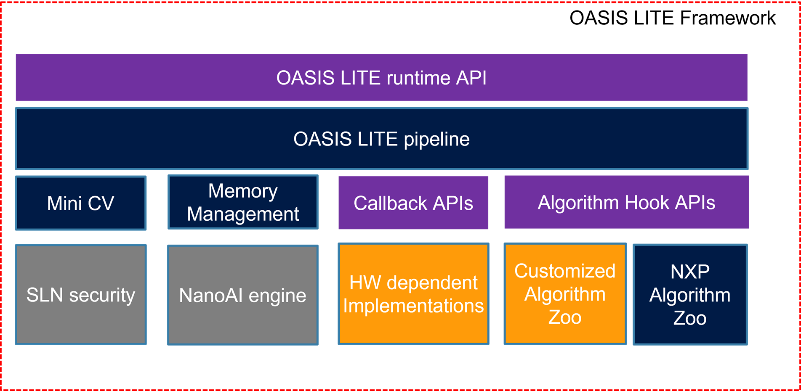
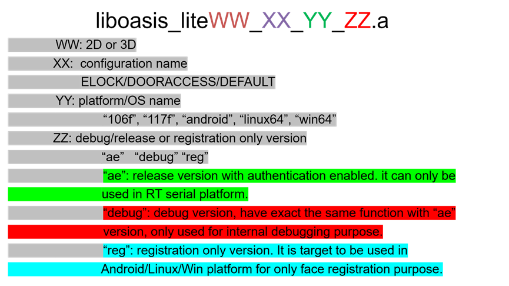

# Introduction

OASIS LITE runtime Library is a tiny, high efficient, customized and optimized AI library, which includes a mini CV, fast speed and optimized inference engine--NanoAI for NXP MCU, and memory management unit. Additionally, there are some AI models(customized for NXP MCUs) embedded in this library. They are face detection, face recognition, front face detection, glass detection, and liveness detection based on RGB or IR images.
It is an idea runtime library for some applications such as entry access control products based on faces identification.

## High Level Architecture

<!--
<fig>
<title> High Level Architecture</title>
<image href="img/high_level_architecture.png">
</image></fig>
-->

## Release and Delivery

The OASIS LITE runtime library is released in static C library format with C header files. We have different library for different platforms and configurations, supported architectures are:

- RT106F and RT117F for bare system or RTOS.
- ARM cortex A core on Android platform.
- X86 64bit on Linux platform.
- X86 64bit on Windows platform.

Released package includes:

- Header file (oasislite_runtime2D.h or oasislite_runtime3D.h)
- Library with following naming rules:

<!--
<fig>
<title> lib_naming_rules</title>
<image href="img/lib_naming_rules.png">
</image></fig>
-->

