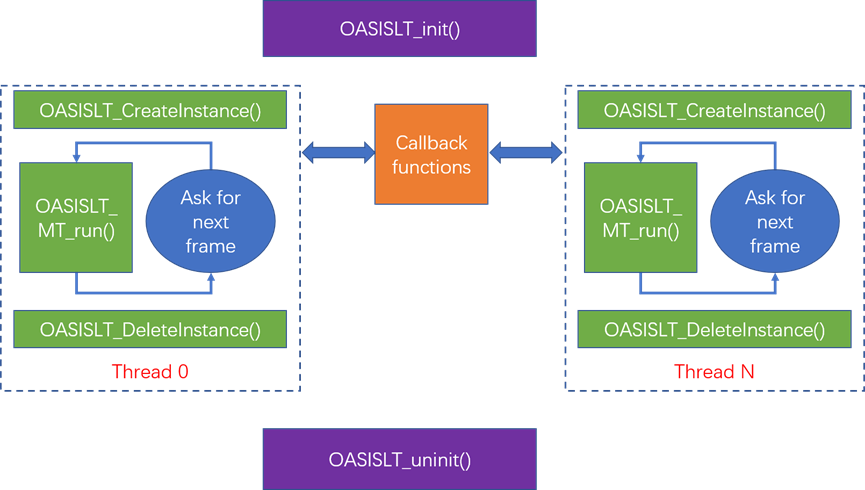

# Multi-thread application

OASIS LITE library for linux64 and Android platform support multi face recognition threads running at the same time. To support this, a new group of APIs is designed.
- OASISLT_CreateInstance
- OASISLT_DeleteInstance
- OASISLT_MT_run_extend
- OASISLT_MT_run_identification
- OASISLT_MT_registration_by_feature

## Calling Sequence



OASISLT_init/uninit should be called firstly/last. In each thread, a handler should be created by calling of OASISLT_CreateInstance firstly. Before exit of current thread, OASISLT_DeleteInstance should be called to delete instance handler.
Pay attention: callback functions can be shared between threads, it is the caller’s responsibility to ensure that shared callback functions are multi-thread secure. To know the instance context inside shared callback functions, “userData” parameter can be used for this purpose.
Maximum thread number OASIS LITE library can support is 1000.

## Sample code

```c
pthread_mutex_t oasis_mutex = PTHREAD_MUTEX_INITIALIZER;
static void self_test_lock()
{
    pthread_mutex_lock(&oasis_mutex);
}

static void self_test_unlock()
{
    pthread_mutex_unlock(&oasis_mutex);
}

static void* thread_fun(void* data)
{
    int ret;
    OASISLTHandler_t handler;
    ret = OASISLT_CreateInstance(&handler);

    if (ret != 0)
    {
        return NULL;
    }else
    {
        PRINT("create instance suc\r\n");
    }

    for (int j = 0;j<100;j++)
    {
        ret = OASISLT_MT_run_extend(handler,
                frames,flag,min_face,data);

        PRINT(“ret:%d\r\n", ret);
    }

    OASISLT_DeleteInstance(handler);
    pthread_exit(NULL);

}

OASISLTInitPara_t init_para = {
        .height = 240,
        .width = 320,
        .img_format = OASIS_IMG_FORMAT_BGR888,
        .min_face = 100,
        .mem_pool = NULL,
        .size = 0,
        .cbs = {
                EvtHandler,
                GetRegisteredFacesHandler,
                AddNewFaceHandler,//add face
                UpdateFaceHandler,
                AdjustBrightness,
                self_test_lock,
                self_test_unlock,
                NULL         
        },
        .enable_flags = OASIS_ENABLE_LIVENESS,
        .false_accept_rate = OASIS_FAR_1_1000000,
        .mod_class = OASISLT_MODEL_CLASS_LIGHT,
};

int ret = 0;
ret = OASISLT_init(&init_para);
if (ret == OASIS_INIT_INVALID_MEMORYPOOL)
{
    init_para.mem_pool = (char*)malloc(init_para.size);
    ret = OASISLT_init(&init_para);
    assert(ret == 0);
}else{
    //some error happen
    Return;
}

pthread_t tids[THREAD_NUM];

for (int i = 0;i<THREAD_NUM;i++)
{
    pthread_create(&tids[i], NULL, thread_fun, &tids[i]);
}

for (int i = 0;i<THREAD_NUM;i++)
{
    pthread_join(tids[i], NULL);
}

OASISLT_uninit();
delete[] init_para.mem_pool;
```