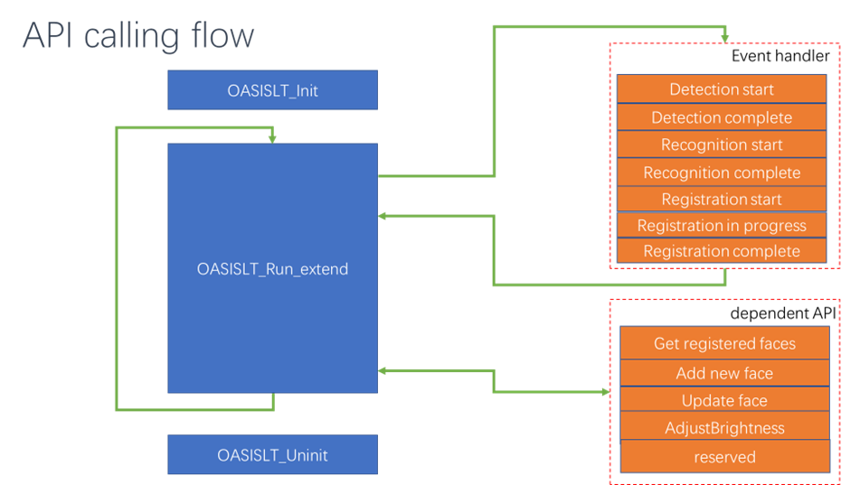
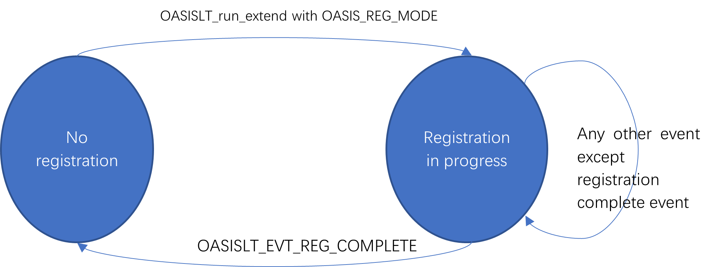

# Single instance application 

## Calling Sequence


## Initializing

```c
OASISLTResult_t OASISLT_init(OASISLTInitPara_t* para);
```

In Initializing procedure, OASISLT_init should be the first API called before any other APIs and caller need provide:

- Input image frame format. It should include image type and maximum height/width in pixels, generally these numbers are equal  to the resolution of camera you are using. And image type you can find in _OASISLTImageType_t_.
- Minimum face size can be detected in pixel, minimum face size in subsequent calling of OASISLT_run_extend can be larger or equal this value but must not less than this value. **We suggest strongly: this value should not less than 100.**
- Recommend OASISLT_init be called twice, in the first call of OASISLT_init, all other parameters should be filled except _memPool_ as NULL and _size_ as zero , by this way, when return, memory size actual needed is in _size_ field. Caller can allocate memory according the _size_ and call OASISLT_init again.
- Fast memory is specifically designed for oasis library internal. This buffer should only be used by inference engine inside. Oasis set NULL as disable. Fast memory buffer size set 0 as disable, suggest (32\*1024) or (64\*1024) or (128\*1024).
- OASIS LITE using callback functions to interact with the user, the results of the algorithm during its execution will be presented in the callback function.

## Scheduling

```c
int OASISLT_run_extend(ImageFrame_t* frames[OASISLT_INT_FRAME_IDX_LAST], uint8_t flag, int minFace, void* userData);
```

In procedure of OASISLT_run_extend, it always communicate with the caller by callback functions provided in OASISLT_init parameters. What OASISLT_run_extend does is related to run flags input, refer to API _run and flags_ chapter for more information.

- Detection start/complete events: they are always triggered after this calling. Caller can get face position information( left top and right bottom points of face box and 5/106 points landmarks).
- Face quality check start/complete events: only be triggered when any face is detected.
- Face recognition start/complete events: is triggered when a face recognition start/complete. If no face is detected or detected face is not qualified, the caller can not receive these events.
- Registration start event: when a new face registration procedure is started.
- Registration in progress event: after a face registration procedure is started, a registration in progress event is triggered when each qualified face feature is extracted and be saved successfully. This event may be called multi-times in face registration procedure.
- Registration complete event: may be triggered when one of the following event happens:
  - All face features required are found and saved. Return OASIS_REG_RESULT_OK.
  - A duplicated face is found in registration procedure, return OASIS_REG_RESULT_DUP.
  - User canceled registration procedure by switching to another running mode, return OASIS_REG_RESULT_CANCELED.
  - Data base operation(by GetFaces/Addface/UpdateFace callbacks user provided) failed in face feature saving, return OASIS_REG_RESULT_DB_OP_FAILED.



In the event callback, caller can hook different handling functions for different event.
For dual input streams case, face detection/recognition and anti-spoofing are going to be done on both frames or one of them depending internal strategies and image type. 

## Face registration states

Face registration procedure is a loop of calling OASISLT_extend(with OASIS_DET_REC_REG run flag) procedure until caller cancel this procedure by call OASISLT_extend with other run flags or OASISLT_EVT_REG_COMPLETE event is received.  During this procedure, caller may receive face detection start/complete , face quality check start/complete event. Each OASISLT_EVT_REG_IN_PROGRESS indicate that registration procedure moves forward a step.

There is result returned for OASISLT_EVT_REG_COMPLETE, by which caller can know registration is successful or failed and get the failure reason.

Expect use case is: 
- Start a timer for registration timeout
- Call OASISLT_extend(with OASIS_DET_REC_REG run flag) repeatedly until timeout or a OASISLT_EVT_REG_COMPLETE event received
- If timeout happens, call OASISLT_extend(with  !OASIS_DET_REC_REG run flag), this will trigger a OASISLT_EVT_REG_COMPLETE with OASIS_REG_RESULT_CANCELED result.
- So, in the end, there is always a OASISLT_EVT_REG_COMPLETE be received.
- Caller can get registration result from the callback parameters.




## Remote registration
Supporting of remote registration is a very important feature of OASIS LITE library. To use this feature, user should do:
- Build PC/Mobile phone APP, remember use appropriate libraries in deliver package.
- In the app, same procedure should be done: library init run_extend (with OASIS_DET_REC_REG_REMOTE run flag) with image streams input, if there is only one image stream, please use same frame for both RGB and IR frames.
- If everything works fine, callback function “AddFace” should be triggered and you face information data can be get here, also snapshot data.
- Transfer these data to device side.
- On device side, call “OASISLT_registration_by_feature” to finish face registration.
- You can get registration result by the return of this function and a valid face ID also is generated if face registration is successful.

## Uninitializing

```c
OASISLTResult_t OASISLT_uninit();
```

## Example

### Initialization

```c
OASISLTInitPara_t   s_oasisInitParam;
memset(&s_oasisInitParam, 0x00, sizeof(OASISLTInitPara_t));

// init the oasis config
s_oasisInitParam.imgType                     = OASIS_IMG_TYPE_IR_RGB_DUAL;
s_oasisInitParam.minFace                     = 100;
s_oasisInitParam.enableFlags                 = 0;
s_oasisInitParam.falseAcceptRate             = OASIS_FAR_1_1000000;
s_oasisInitParam.height                      = OASIS_RGB_FRAME_HEIGHT;
s_oasisInitParam.width                       = OASIS_RGB_FRAME_WIDTH;
s_oasisInitParam.size                        = 0;
s_oasisInitParam.memPool                     = NULL;
s_oasisInitParam.fastMemSize                 = OASIS_FAST_MEMORY_BUF;
s_oasisInitParam.fastMemBuf                  = (char *)malloc(OASIS_FAST_MEMORY_BUF);
if (s_oasisInitParam.fastMemBuf == NULL)
{
    return kAlgo_status_MemPool;
}

s_oasisInitParam.cbs.EvtCb            = _oasis_evtCb;
s_oasisInitParam.cbs.GetFaces         = _oasis_getFace;
s_oasisInitParam.cbs.AddFace          = _oasis_addFace;
s_oasisInitParam.cbs.UpdateFace       = _oasis_updFace;
s_oasisInitParam.cbs.DeleteFace       = _oasis_delFace;
s_oasisInitParam.cbs.AdjustBrightness = _oasis_adjustBrightness;
s_oasisInitParam.cbs.reserved         = (void *)_oasis_log;

OASISLTResult_t ret = OASISLT_init(&s_oasisInitParam);
if (ret == OASIS_INIT_INVALID_MEMORYPOOL)
{
    s_oasisInitParam.memPool = (char *)malloc(s_oasisInitParam.size);
    if (s_oasisInitParam.memPool == NULL)
    {
        if (s_oasisInitParam.fastMemBuf != NULL)
        {
            free(s_oasisInitParam.fastMemBuf);
        }

        return kAlgo_status_MemPool;
    }

    ret = OASISLT_init(&s_oasisInitParam);
}
```

### Run

```c
ImageFrame_t        s_oasisFrames[OASISLT_INT_FRAME_IDX_LAST];
ImageFrame_t        *pOasisFrames[OASISLT_INT_FRAME_IDX_LAST];

s_oasisFrames[OASISLT_INT_FRAME_IDX_RGB].fmt      = OASIS_IMG_FORMAT_BGR888;
s_oasisFrames[OASISLT_INT_FRAME_IDX_RGB].height   = OASIS_RGB_FRAME_HEIGHT;
s_oasisFrames[OASISLT_INT_FRAME_IDX_RGB].width    = OASIS_RGB_FRAME_WIDTH;
s_oasisFrames[OASISLT_INT_FRAME_IDX_RGB].data     = NULL;
pOasisFrames[OASISLT_INT_FRAME_IDX_RGB]           = &s_oasisFrames[OASISLT_INT_FRAME_IDX_RGB];

s_oasisFrames[OASISLT_INT_FRAME_IDX_IR].fmt       = OASIS_IMG_FORMAT_BGR888;
s_oasisFrames[OASISLT_INT_FRAME_IDX_IR].height    = OASIS_IR_FRAME_HEIGHT;
s_oasisFrames[OASISLT_INT_FRAME_IDX_IR].width     = OASIS_IR_FRAME_WIDTH;
s_oasisFrames[OASISLT_INT_FRAME_IDX_IR].data      = NULL;
pOasisFrames[OASISLT_INT_FRAME_IDX_IR] = &s_oasisFrames[OASISLT_INT_FRAME_IDX_IR];

while(1)
{

    pOasisFrames[OASISLT_INT_FRAME_IDX_RGB]->data = pFrame[0];
    pOasisFrames[OASISLT_INT_FRAME_IDX_IR]->data  = pFrame[1];

    int oasisRet = OASISLT_run_extend(pOasisFrames, oasis_run_flag, 100, &s_oasisInitParam);
}
```

### Event callback

```c
void _oasis_evtCb(ImageFrame_t *frames[], OASISLTEvt_t evt, OASISLTCbPara_t *para, void *userData)
{
    switch (evt)
    {
        case OASISLT_EVT_DET_START:
        {

        }
        break;

        case OASISLT_EVT_DET_COMPLETE:
        {
            if (para->faceBoxRGB == NULL && para->faceBoxIR == NULL)
            {
                LOGD("[OASIS] DET:No face detected\r\n");
            }
            else
            {
                if (para->faceBoxRGB != NULL)
                {
                    LOGD("[OASIS] DET:[Left: %d, Top: %d, Right: %d, Bottom: %d]\r\n", para->faceBoxRGB->rect[0],
                        para->faceBoxRGB->rect[1], para->faceBoxRGB->rect[2], para->faceBoxRGB->rect[3]);
                }

                if (para->faceBoxIR != NULL)
                {
                    LOGD("[OASIS] DET:[Left: %d, Top: %d, Right: %d, Bottom: %d]\r\n", para->faceBoxIR->rect[0],
                        para->faceBoxIR->rect[1], para->faceBoxIR->rect[2], para->faceBoxIR->rect[3]);
                }
            }
        }
        break;

        case OASISLT_EVT_QUALITY_CHK_START:
        break;

        case OASISLT_EVT_QUALITY_CHK_COMPLETE:
        {
            switch (para->qualityResult)
            {
                case OASIS_QUALITY_RESULT_FACE_OK:
                {
                    LOGD("[OASIS] Quality:ok. \r\n");
                }
                break;

                case OASIS_QUALITY_RESULT_FACE_TOO_SMALL:
                {
                    LOGD("[OASIS] Quality:Small Face\r\n");
                }
                break;

                case OASIS_QUALITY_RESULT_FAIL_BRIGHTNESS_DARK:
                case OASIS_QUALITY_RESULT_FAIL_BRIGHTNESS_OVEREXPOSURE:
                {
                    LOGD("[OASIS] Quality:Face Brightness\r\n");
                break;

                case OASIS_QUALITY_RESULT_FACE_BLUR:
                {
                    LOGD("[OASIS] Quality:Blurry Face\r\n");
                }
                break;

                case OASIS_QUALITY_RESULT_FACE_ORIENTATION_UNMATCH:
                {
                    LOGD("[OASIS] Quality:Side face\r\n");
                }
                break;

                case OASIS_QUALITY_RESULT_PARTIAL_BRIGHTNESS_FAIL:
                {

                }
                break;

                case OASIS_QUALITY_RESULT_RGB_FAKE:
                {
                    LOGD("[OASIS] Quality:rgb fake\r\n");
                }
                break;

                case OASIS_QUALITY_RESULT_IR_FAKE:
                {
                    LOGD("[OASIS] Quality:ir fake\r\n");
                }
                break;

                default:
                    break;
            }
        }
        break;

        case OASISLT_EVT_REC_START:
        break;

        case OASISLT_EVT_REC_COMPLETE:
        {
            if (para->recResult == OASIS_REC_RESULT_KNOWN_FACE)
            {
                LOGD("[OASIS] KNOWN_FACE\r\n")
            }
            else if (para->recResult == OASIS_REC_RESULT_UNKNOWN_FACE)
            {
                LOGD("[OASIS] UNKNOWN_FACE\r\n");
            }
            else
            {
                LOGD("[OASIS] INVALID_FACE\r\n");
            }
        }
        break;

        case OASISLT_EVT_REG_START:
        break;

        case OASISLT_EVT_REG_IN_PROGRESS:
        break;

        case OASISLT_EVT_REG_COMPLETE:
        {
            if (para->regResult == OASIS_REG_RESULT_OK)
            {
                LOGD("[OASIS] REGISTRATION SUCCESS id:[%d]\r\n", para->faceID);
            }
            else if (para->regResult == OASIS_REG_RESULT_DUP)
            {
                LOGD("[OASIS] REGISTRATION DUPLICATED id:%d\r\n", para->faceID);
            }
        }
        break;

        default:
        break;
    }
}
```
