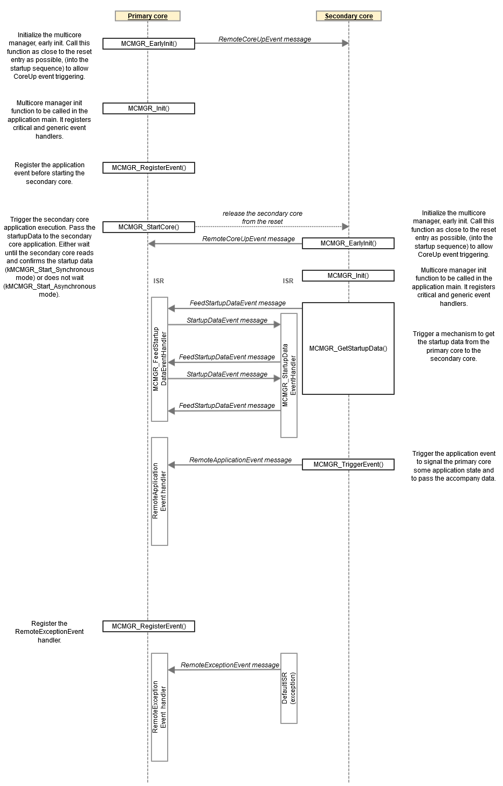

# Multicore Devices

The multicore HAL device represents an abstraction used to implement a device which handles all multicore message passing


The Multicore HAL device is primarily used as a wrapper over known multicore message libraries,

be it MU/Mailbox peripheral registers, rpmsg_lite, eRPC, etc.


In terms of functionality,
the multicore HAL device provides:

- Send operation
- Receive operation


## Device Definition

The HAL device definition for multicore devices can be found under `framework/hal_api/hal_multicore_dev.h` and is reproduced below:

```c title="framework/hal_api/hal_multicore_dev.h"
/*! @brief Attributes of a multicore device. */
struct _multicore_dev
{
    /* unique id which is assigned by multicore manager during the registration */
    int id;
    /* name of the device */
    char name[DEVICE_NAME_MAX_LENGTH];
    /* operations */
    const multicore_dev_operator_t *ops;
    /* private capability */
    multicore_dev_private_capability_t cap;
};
```

The device [operators](#operators) associated with multicore HAL devices are as shown below:

```c

/*! @brief Operation that needs to be implemented by a multicore device */
typedef struct _multicore_dev_operator
{
    /* initialize the dev */
    hal_multicore_status_t (*init)(multicore_dev_t *dev, multicore_dev_callback_t callback, void *param);
    /* deinitialize the dev */
    hal_multicore_status_t (*deinit)(const multicore_dev_t *dev);
    /* start the dev */
    hal_multicore_status_t (*start)(const multicore_dev_t *dev);
    /* Multicore Send the message */
    hal_multicore_status_t (*send)(const multicore_dev_t *dev, void *data, unsigned int size);
    /* input notify */
    hal_multicore_status_t (*inputNotify)(const multicore_dev_t *dev, void *data);
} multicore_dev_operator_t;
```

In order to achieve a two way communication between cores,
hal devices need to implement both send and receive operations.
The send is triggered by the multicore manager,
while receive is async, the other core being able to send at any moment.
All async operations are handled within Multicore manager callback.
```c
/**
 * @brief callback function to notify multicore manager that an async event took place
 * @param dev Device structure of the multicore device calling this function
 * @param event  the event that took place
 * @param fromISR True if this operation takes place in an irq, 0 otherwise
 * @return 0 if the operation was successfully
 */
typedef int (*multicore_dev_callback_t)(const multicore_dev_t *dev, multicore_event_t event, uint8_t fromISR);

/*! @brief Structure that characterizes the multicore device. */
typedef struct _multicore_dev_private_capability
{
    /* callback */
    multicore_dev_callback_t callback;

} multicore_dev_private_capability_t;
```

## Operators

Operators are functions which "operate" on a HAL device itself.
Operators are akin to "public methods" in object oriented-languages.

For more information about operators, see [Operators](overview.md#Operators).

### Init

```c
/* initialize the dev */
hal_multicore_status_t (*init)(multicore_dev_t *dev, multicore_dev_callback_t callback, void *param);
```

`Init` should initialize any hardware resources required by the multicore device (pins, ports, clock, etc).

### Deinit

```c
/* deinitialize the dev */
hal_multicore_status_t (*deinit)(const multicore_dev_t *dev);
```

"Deinitialize" the multicore device.

`DeInit` should release any hardware resources a multicore device might use (I/O ports, IRQs, etc.), turn off the hardware, and perform any other shutdown the device requires.

### Start

```c
/* start the dev */
hal_multicore_status_t (*start)(const multicore_dev_t *dev);
```

`Start` should start the flow. Handshake protocol can be implemented.
The purpose of a handshake protocol is to verify that both cores initialized properly the multicore unit.

### Send

```c
/* Multicore Send the message */
hal_multicore_status_t (*send)(const multicore_dev_t *dev, void *data, unsigned int size);
```

Multicore manager will pass a buffer to the underlying level. The multicore device needs to send the message,
characterized by the size,
to the counterpart device from the other core.
On the other side, after receiving the message,
the hal device is responsible to call the callback,
in order to make the multicore manager aware of the new message.


## FreeRTOS message buffer Device

Message buffers from FreeRTOS are used for one way communication between two threads.
In order to create a two way communication, a send task and receive task need to be created on both cores.
Multicore Manager will act as a `send task`, while the `receive task` is created within the Hal device init. The receive task also inherits the priority of the send task.
The portable layer, mandatory for this message buffer solution to work in dual core system, is provided as part of the SDK middleware for RT1170 and is based on the MCMGR middleware. MCMGR uses under the hood the MU peripheral.



The send and receive task should be built having a non-blocking design pattern in mind and they should be initialized with highest priority in order to have the best response time.

The number of shared buffers that need to be allocated is two, one for each one way communication. The size is at least the maximum message size, after a deep copy has been performed. They should be allocated statically at compile or a procedure to advertise between cores the address should be implemented.
* CM7/ Write Buffer = CM4/ Read Buffer
* CM4/ Write Buffer = CM7/ Read Buffer

For more information about RTOS Message Buffers API check FreeRTOS [docs](https://www.freertos.org/RTOS-message-buffer-API.html)


```c title="framework/hal/misc/hal_multicore_messageBuffer.c"
void vGenerateMulticoreInterrupt(void *xUpdatedMessageBuffer)
{
    /* Trigger the inter-core interrupt using the MCMGR component.
       Pass the APP_MESSAGE_BUFFER_EVENT_DATA as data that accompany
       the kMCMGR_FreeRtosMessageBuffersEvent event. */
    (void)MCMGR_TriggerEventForce(kMCMGR_FreeRtosMessageBuffersEvent, kMulticore_DataEvent);
}

static void RemoteAppReadyEventHandler(uint16_t eventData, void *context)
{
    *(bool *)context = (bool)eventData;
}

static void FreeRtosMessageBuffersEventHandler(uint16_t eventData, void *context)
{
    BaseType_t xHigherPriorityTaskWoken = pdFALSE;

    /* Make sure the message has been addressed to us. Using eventData that accompany
       the event of the kMCMGR_FreeRtosMessageBuffersEvent type, we can distinguish
       different consumers. */
    if (kMulticore_DataEvent == eventData)
    {
        /* Call the API function that sends a notification to any task that is
    blocked on the xUpdatedMessageBuffer message buffer waiting for data to
    arrive. */
        (void)xMessageBufferSendCompletedFromISR(xReadMessageBuffer, &xHigherPriorityTaskWoken);
    }

    /* Normal FreeRTOS "yield from interrupt" semantics, where
    HigherPriorityTaskWoken is initialzed to pdFALSE and will then get set to
    pdTRUE if the interrupt unblocks a task that has a priority above that of
    the currently executing task. */
    portYIELD_FROM_ISR(xHigherPriorityTaskWoken);

    /* No need to clear the interrupt flag here, it is handled by the mcmgr. */
}

static void _HAL_MulticoreDev_MessageBuffer_RcvMsgHandler(void *param)
{
    /* Size to cover on MAX message. Can be lowered if we know what we send */
    static uint8_t pMessageBufferRcv[MB_STORAGE_BUFFER_SIZE];

    while (1)
    {
        size_t xReceivedBytes = xMessageBufferReceive(xReadMessageBuffer, (void *)pMessageBufferRcv,
                                                      sizeof(pMessageBufferRcv), portMAX_DELAY);

        LOGI("Remote Message receive, size = %d", xReceivedBytes);
        if ((xReceivedBytes != 0) && (s_MulticoreDev_MessageBuffer.cap.callback != NULL))
        {
            multicore_event_t multicore_event;
            multicore_event.eventId = kMulticoreEvent_MsgReceive;
            multicore_event.data    = pMessageBufferRcv;
            multicore_event.size    = xReceivedBytes;
            s_MulticoreDev_MessageBuffer.cap.callback(&s_MulticoreDev_MessageBuffer, multicore_event, false);
        }
    }
}

static hal_multicore_status_t HAL_MulticoreDev_MessageBuffer_Deinit(const multicore_dev_t *dev)
{
    hal_multicore_status_t status = kStatus_HAL_MulticoreSuccess;

    return status;
}

static hal_multicore_status_t HAL_MulticoreDev_MessageBuffer_Send(const multicore_dev_t *dev, void *data, uint32_t size)
{
    hal_multicore_status_t status = kStatus_HAL_MulticoreSuccess;

    if ((data != NULL) && (size != 0))
    {
        uint32_t streamFreeSpace = xStreamBufferSpacesAvailable(xWriteMessageBuffer);
        if (streamFreeSpace < size)
        {
            status = kStatus_HAL_MulticoreError;
            LOGE("Not enough space, free %x needed %x", streamFreeSpace, size);
        }

        if (status == kStatus_HAL_MulticoreSuccess)
        {
            (void)xMessageBufferSend(xWriteMessageBuffer, data, size, 0);
            LOGI("MulticoreDev_send: Send %d bytes", size);
        }
    }
    else
    {
        LOGD("MulticoreDev_send: Nothing to send");
    }

    return status;
}

static hal_multicore_status_t HAL_MulticoreDev_MessageBuffer_InputNotify(const multicore_dev_t *dev, void *data)
{
    hal_multicore_status_t status = kStatus_HAL_MulticoreSuccess;

    return status;
}

static hal_multicore_status_t HAL_MulticoreDev_MessageBuffer_Start(const multicore_dev_t *dev)
{
    hal_multicore_status_t status = kStatus_HAL_MulticoreSuccess;

    /* Wait until the secondary core application signals it is ready to communicate. */
    while (true != s_SecondCoreReady)
    {
        (void)MCMGR_TriggerEvent(kMCMGR_RemoteApplicationEvent, true);
        vTaskDelay(pdMS_TO_TICKS(10));
    };

    /* Send one more event to be sure the other core got it */
    (void)MCMGR_TriggerEvent(kMCMGR_RemoteApplicationEvent, true);

    if (xTaskCreate(_HAL_MulticoreDev_MessageBuffer_RcvMsgHandler, MULTICORE_RCV_TASK_NAME, MULTICORE_RCV_TASK_STACK,
                    NULL, uxTaskPriorityGet(NULL), NULL) != pdPASS)
    {
        LOGE("[MessageBuffer] Task creation failed!.");
        while (1)
            ;
    }

    return status;
}

static hal_multicore_status_t HAL_MulticoreDev_MessageBuffer_Init(multicore_dev_t *dev,
                                                                  multicore_dev_callback_t callback,
                                                                  void *param)
{
    hal_multicore_status_t status = kStatus_HAL_MulticoreSuccess;
    LOGD("Start Multicore MessageBuffer INIT");

    s_MulticoreDev_MessageBuffer.cap.callback = callback;

    xWriteMessageBuffer = xMessageBufferCreateStatic(
        /* The buffer size in bytes. */
        MB_STORAGE_BUFFER_SIZE,
        /* Statically allocated buffer storage area. */
        &ucWriteMessageBufferStorage,
        /* Message buffer handle. */
        &xWriteMessageBufferStruct);

    (void)MCMGR_RegisterEvent(kMCMGR_FreeRtosMessageBuffersEvent, FreeRtosMessageBuffersEventHandler, ((void *)0));
    (void)MCMGR_RegisterEvent(kMCMGR_RemoteApplicationEvent, RemoteAppReadyEventHandler, (void *)&s_SecondCoreReady);

    /* We initied we are ready to rcv messages */
    LOGD("Exit Multicore MessageBuffer INIT");
    return status;
}

