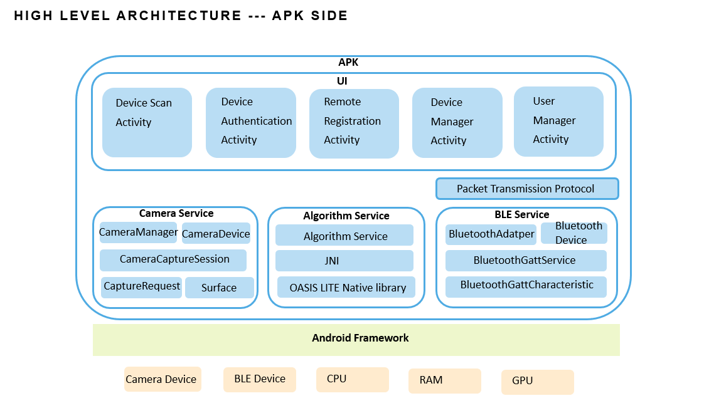
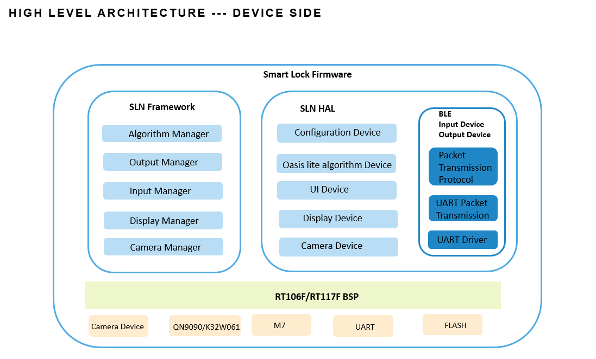
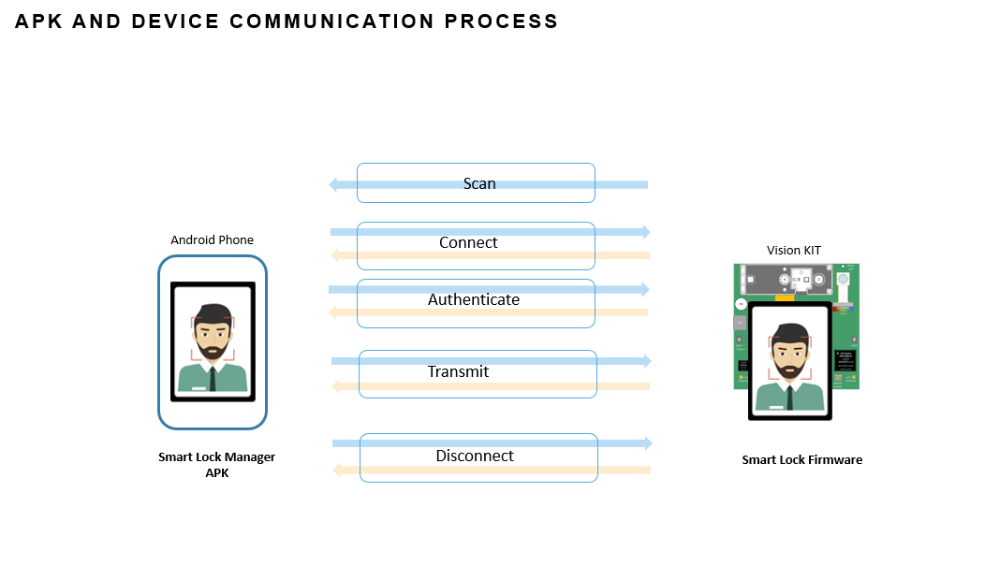
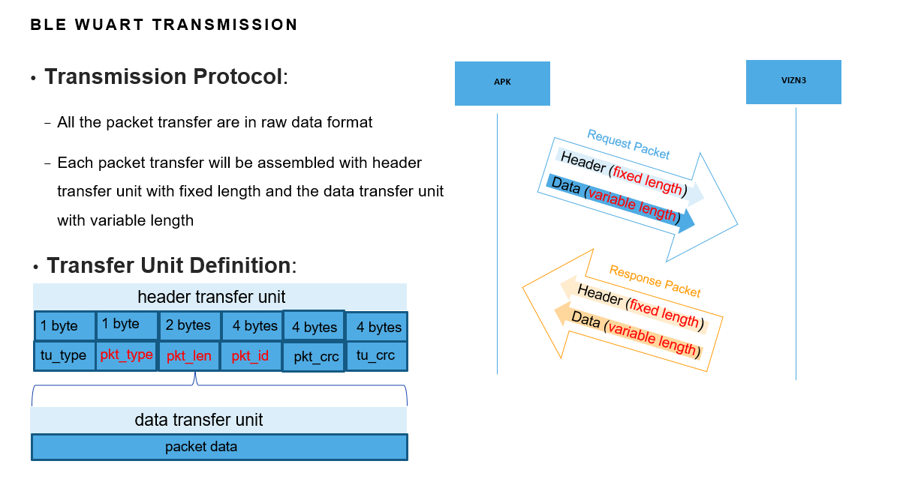
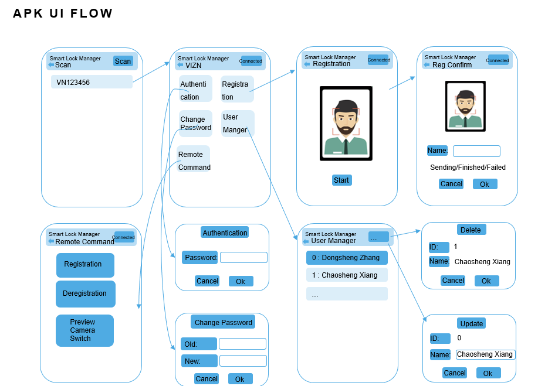

# Smart Lock Manager

## Introduction
Smart Lock Manager is an Android application to manage the smart lock device based on NXP's vision solution through the BLE connection.

---
## Key Functions
- Feature based remote registration
  * Do the face data extraction on the mobile phone APK by oasis lite library with phone’s camera
  * Send the extracted face feature with BLE to vizn3d/viznlc kit by BLE
  * Do the face feature based registration in the vizn3d/viznlc kit

- Device management
  * Password based authentication
  * Password update

- User management
  * User list preview
  * User name update
  * User delete

- Remote command
  * Registration Command
  * Deregistration Command
  * Preview camera switch Command
---

## Architecture

## Communication Process

## Transmission Protocol

## Packet Definition

### Transfer Unit Type And Packet Type

|   TU Type  |      Value    | Comment |
| :-------:  | :----------:  | :---------: |
|    header  |      0x79     |   Header TU |
|    data    |      0x80     |   Data TU   |

|   Packet Type       |   Value  |        Comment          | Direction   |
| :---------------   | :------: | :--------------------  | :--------- |
| AUTHENTICATION_REQ  |     0    | Authentication request  | APK->Device |
| AUTHENTICATION_RES  |     1    | Authentication response | Device->APK |
| UPDATE_PASSWORD_REQ |     2    | Update password request | APK->Device |
| UPDATE_PASSWORD_RES |     3    | Update password response | Device->APK |
| REGISTRATION_REQ    |     4    | Remote registration request  | APK->Device |
| REGISTRATION_RES    |     5    | Remote registration response | Device->APK |
| DELETE_USER_REQ     |     6    | Remote delete user request  | APK->Device |
| DELETE_USER_RES     |     7    | Remote delete user response | Device->APK |
| GET_USER_COUNT_REQ  |     8    | Get user count request  | APK->Device |
| GET_USER_COUNT_RES  |     9    | Get user count response | Device->APK |
| GET_USER_INFO_REQ   |     10   | Get user information request | APK->Device |
| GET_USER_INFO_RES   |     11   | Get user information response | Device->APK |
| UPDATE_USER_INFO_REQ  |     12    | Update user information request  | APK->Device |
| UPDATE_USER_INFO_RES  |     13    | Update user information response | Device->APK |
| REGISTRATION_CMD_REQ  |     14   | Registration command request | APK->Device |
| REGISTRATION_CMD_RES  |     15   | Registration command response | Device->APK |
| DEREGISTRATION_CMD_REQ  |     16   | Deregistration command request | APK->Device |
| DEREGISTRATION_CMD_RES  |     17   | Deregistration command response | Device->APK |
| PREVIEWCAMERA_SWITCH_CMD_REQ  |     18   | Preview camera switch request | APK->Device |
| PREVIEWCAMERA_SWITCH_CMD_RES  |     19   | Preview camera switch response | Device->APK |

### AUTHENTICATION
#### AUTHENTICATION_REQ
|           |   Items  |  Bytes  | Value |
| :-------- | :------  | :------:| :---- |
|  Header Tu| Tu_type  |   1     | 0x79  |
|           | pkt_type |   1     | 0     |
|           | pkt_len  |   2     | 6     |
|           | pkt_id   |   4     | Packet ID |
|           | pkt_crc  |   4     |       |
|           | tu_crc   |   4     |       |
|  Data Tu  | password |   6     | Password user typed in |

#### AUTHENTICATION_RES
|           |   Items  |  Bytes  | Value |
| :-------- | :------  | :------:| :---- |
|  Header Tu| Tu_type  |   1     | 0x79  |
|           | pkt_type |   1     | 1     |
|           | pkt_len  |   2     | 1     |
|           | pkt_id   |   4     | Packet ID |
|           | pkt_crc  |   4     |       |
|           | tu_crc   |   4     |       |
|  Data Tu  | status   |   1     | 0: success; other: error code |

### UPDATE_PASSWORD
#### UPDATE_PASSWORD_REQ
|           |   Items  |  Bytes  | Value |
| :-------- | :------  | :------:| :---- |
|  Header Tu| Tu_type  |   1     | 0x79  |
|           | pkt_type |   1     | 2     |
|           | pkt_len  |   2     | 6     |
|           | pkt_id   |   4     | Packet ID |
|           | pkt_crc  |   4     |       |
|           | tu_crc   |   4     |       |
|  Data Tu  | password |   6     | New Password  |

#### UPDATE_PASSWORD_RES
|           |   Items  |  Bytes  | Value |
| :-------- | :------  | :------:| :---- |
|  Header Tu| Tu_type  |   1     | 0x79  |
|           | pkt_type |   1     | 3     |
|           | pkt_len  |   2     | 1     |
|           | pkt_id   |   4     | Packet ID |
|           | pkt_crc  |   4     |       |
|           | tu_crc   |   4     |       |
|  Data Tu  | status   |   1     | 0: success; other: error code |

### REGISTRATION
#### REGISTRATION_REQ
|           |   Items  |  Bytes  | Value |
| :-------- | :------  | :------:| :---- |
|  Header Tu| Tu_type  |   1     | 0x79  |
|           | pkt_type |   1     | 4     |
|           | pkt_len  |   2     | 432     |
|           | pkt_id   |   4     | Packet ID |
|           | pkt_crc  |   4     |       |
|           | tu_crc   |   4     |       |
|  Data Tu  | name     |   32    | User Name  |
|           | face data|   400   | Face Data  |

#### REGISTRATION_RES
|           |   Items  |  Bytes  | Value |
| :-------- | :------  | :------:| :---- |
|  Header Tu| Tu_type  |   1     | 0x79  |
|           | pkt_type |   1     | 5     |
|           | pkt_len  |   2     | 1     |
|           | pkt_id   |   4     | Packet ID |
|           | pkt_crc  |   4     |       |
|           | tu_crc   |   4     |       |
|  Data Tu  | status   |   1     | 0: success; 1: duplicate registration; other: error code |

### DELETE_USER
#### DELETE_USER_REQ
|           |   Items  |  Bytes  | Value |
| :-------- | :------  | :------:| :---- |
|  Header Tu| Tu_type  |   1     | 0x79  |
|           | pkt_type |   1     | 6     |
|           | pkt_len  |   2     | 4     |
|           | pkt_id   |   4     | Packet ID |
|           | pkt_crc  |   4     |       |
|           | tu_crc   |   4     |       |
|  Data Tu  | face id     |   4   | Unique face id |

#### DELETE_USER_RES
|           |   Items  |  Bytes  | Value |
| :-------- | :------  | :------:| :---- |
|  Header Tu| Tu_type  |   1     | 0x79  |
|           | pkt_type |   1     | 7     |
|           | pkt_len  |   2     | 1     |
|           | pkt_id   |   4     | Packet ID |
|           | pkt_crc  |   4     |       |
|           | tu_crc   |   4     |       |
|  Data Tu  | status   |   1     | 0: success; 1: duplicate registration; other: error code |

### GET_USER_COUNT
#### GET_USER_COUNT_REQ
|           |   Items  |  Bytes  | Value |
| :-------- | :------  | :------:| :---- |
|  Header Tu| Tu_type  |   1     | 0x79  |
|           | pkt_type |   1     | 8     |
|           | pkt_len  |   2     | 0     |
|           | pkt_id   |   4     | Packet ID |
|           | pkt_crc  |   4     |       |
|           | tu_crc   |   4     |       |
|  Data Tu  |          |         |       |

#### GET_USER_COUNT_RES
|           |   Items  |  Bytes  | Value |
| :-------- | :------  | :------:| :---- |
|  Header Tu| Tu_type  |   1     | 0x79  |
|           | pkt_type |   1     | 9     |
|           | pkt_len  |   2     | 4     |
|           | pkt_id   |   4     | Packet ID |
|           | pkt_crc  |   4     |       |
|           | tu_crc   |   4     |       |
|  Data Tu  | user count |   4 | count |

### GET_USER_INFO
#### GET_USER_INFO_REQ
|           |   Items  |  Bytes  | Value |
| :-------- | :------  | :------:| :---- |
|  Header Tu| Tu_type  |   1     | 0x79  |
|           | pkt_type |   1     | 10     |
|           | pkt_len  |   2     | 0     |
|           | pkt_id   |   4     | Packet ID |
|           | pkt_crc  |   4     |       |
|           | tu_crc   |   4     |       |
|  Data Tu  |          |         |       |

#### GET_USER_INFO_RES
|           |   Items  |  Bytes  | Value |
| :-------- | :------  | :------:| :---- |
|  Header Tu| Tu_type  |   1     | 0x79  |
|           | pkt_type |   1     | 11     |
|           | pkt_len  |   2     | 36     |
|           | pkt_id   |   4     | Packet ID |
|           | pkt_crc  |   4     |       |
|           | tu_crc   |   4     |       |
|  Data Tu  | user ID  |   4     | User ID |
|           | user name |   32   | User Name |

### UPDATE_USER_INFO
#### UPDATE_USER_INFO_REQ
|           |   Items  |  Bytes  | Value |
| :-------- | :------  | :------:| :---- |
|  Header Tu| Tu_type  |   1     | 0x79  |
|           | pkt_type |   1     | 12     |
|           | pkt_len  |   2     | 36     |
|           | pkt_id   |   4     | Packet ID |
|           | pkt_crc  |   4     |       |
|           | tu_crc   |   4     |       |
|  Data Tu  | user ID  |   4     | User ID to be updated |
|           | user name |   32   | New User Name |

#### UPDATE_USER_INFO_RES
|           |   Items  |  Bytes  | Value |
| :-------- | :------  | :------:| :---- |
|  Header Tu| Tu_type  |   1     | 0x79  |
|           | pkt_type |   1     | 13     |
|           | pkt_len  |   2     | 1     |
|           | pkt_id   |   4     | Packet ID |
|           | pkt_crc  |   4     |       |
|           | tu_crc   |   4     |       |
|  Data Tu  | status   |   1     | 0: success; other: error code |

### REGISTRATION_CMD
#### REGISTRATION_CMD_REQ
|           |   Items  |  Bytes  | Value |
| :-------- | :------  | :------:| :---- |
|  Header Tu| Tu_type  |   1     | 0x79  |
|           | pkt_type |   1     | 14     |
|           | pkt_len  |   2     | 0     |
|           | pkt_id   |   4     | Packet ID |
|           | pkt_crc  |   4     |       |
|           | tu_crc   |   4     |       |
|  Data Tu  |          |         |       |

#### REGISTRATION_CMD_RES
|           |   Items  |  Bytes  | Value |
| :-------- | :------  | :------:| :---- |
|  Header Tu| Tu_type  |   1     | 0x79  |
|           | pkt_type |   1     | 15     |
|           | pkt_len  |   2     | 1     |
|           | pkt_id   |   4     | Packet ID |
|           | pkt_crc  |   4     |       |
|           | tu_crc   |   4     |       |
|  Data Tu  | status   |   1     | 0: success; other: error code |

### DEREGISTRATION_CMD
#### DEREGISTRATION_CMD_REQ
|           |   Items  |  Bytes  | Value |
| :-------- | :------  | :------:| :---- |
|  Header Tu| Tu_type  |   1     | 0x79  |
|           | pkt_type |   1     | 16     |
|           | pkt_len  |   2     | 0     |
|           | pkt_id   |   4     | Packet ID |
|           | pkt_crc  |   4     |       |
|           | tu_crc   |   4     |       |
|  Data Tu  |          |         |       |

#### DEREGISTRATION_CMD_RES
|           |   Items  |  Bytes  | Value |
| :-------- | :------  | :------:| :---- |
|  Header Tu| Tu_type  |   1     | 0x79  |
|           | pkt_type |   1     | 17     |
|           | pkt_len  |   2     | 1     |
|           | pkt_id   |   4     | Packet ID |
|           | pkt_crc  |   4     |       |
|           | tu_crc   |   4     |       |
|  Data Tu  | status   |   1     | 0: success; other: error code |

### PREVIEWCAMERA_SWITCH_CMD
#### PREVIEWCAMERA_SWITCH_CMD_REQ
|           |   Items  |  Bytes  | Value |
| :-------- | :------  | :------:| :---- |
|  Header Tu| Tu_type  |   1     | 0x79  |
|           | pkt_type |   1     | 18     |
|           | pkt_len  |   2     | 0     |
|           | pkt_id   |   4     | Packet ID |
|           | pkt_crc  |   4     |       |
|           | tu_crc   |   4     |       |
|  Data Tu  |          |         |       |

#### PREVIEWCAMERA_SWITCH_CMD_RES
|           |   Items  |  Bytes  | Value |
| :-------- | :------  | :------:| :---- |
|  Header Tu| Tu_type  |   1     | 0x79  |
|           | pkt_type |   1     | 19    |
|           | pkt_len  |   2     | 1     |
|           | pkt_id   |   4     | Packet ID |
|           | pkt_crc  |   4     |       |
|           | tu_crc   |   4     |       |
|  Data Tu  | status   |   1     | 0: success; other: error code |

## UI FLOW
